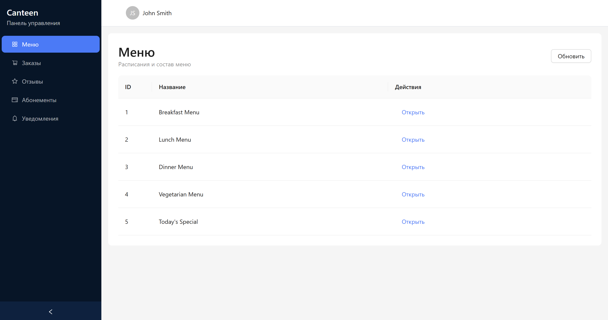

# Система управления школьной столовой



## 📋 О проекте

Веб-приложение для автоматизации процессов учёта и контроля питания в школьной столовой. Система обеспечивает удобный интерфейс для учеников, поваров и администраторов, позволяя эффективно управлять заказами, меню, заявками на закупку и формировать отчётность.

**Разработано в рамках Московской предпрофессиональной олимпиады школьников, профиль "Информационные технологии", командный кейс № 2.**

---

## 🎯 Функциональность

### Для ученика:
- Регистрация и авторизация в системе
- Просмотр меню завтраков и обедов
- Оплата питания (разовый платеж или абонемент)
- Отметка о получении питания
- Указание пищевых аллергий и предпочтений
- Оставление отзывов о блюдах с рейтингом

### Для повара:
- Авторизация в системе
- Учёт выданных заказов
- Контроль готовых блюд
- Внесение заявок на закупку продуктов

### Для администратора:
- Авторизация с расширенными правами
- Просмотр статистики оплат и посещаемости
- Согласование заявок на закупки
- Формирование отчётов по питанию и затратам (PDF)

### Дополнительно:
- Система уведомлений
- Адаптивный интерфейс

---

## 🛠 Технологический стек

### Backend
- **Язык программирования:** Python 3.12+
- **Фреймворк:** FastAPI 0.128.0
- **ORM:** SQLAlchemy 2.0.45
- **Валидация данных:** Pydantic 2.12.5
- **СУБД:** SQLite (режим разработки) / PostgreSQL (production)
- **Асинхронность:** asyncio, aiosqlite
- **Генерация PDF:** ReportLab 4.4.9
- **Веб-сервер:** Uvicorn 0.40.0

**Обоснование выбора:**
- **Python** — язык с простым синтаксисом, богатой экосистемой библиотек и высокой производительностью для веб-приложений
- **FastAPI** — современный асинхронный фреймворк с автоматической генерацией документации OpenAPI, встроенной валидацией данных и высокой скоростью работы
- **SQLAlchemy** — мощная ORM с поддержкой асинхронных операций и миграций БД
- **SQLite** — встроенная СУБД, не требующая отдельного сервера, идеальна для разработки и демонстрации

### Frontend
- **Язык программирования:** TypeScript 5.9+
- **Библиотека UI:** React 19.2.4
- **Маршрутизация:** React Router 7.12.0
- **UI-компоненты:** Ant Design 6.2.2
- **HTTP-клиент:** Axios 1.13.4
- **Стилизация:** Tailwind CSS 4.1.13
- **Сборщик:** Vite 7.1.7

**Обоснование выбора:**
- **TypeScript** — типизированный JavaScript для повышения надёжности кода и улучшения разработки
- **React** — популярная библиотека для создания интерактивных пользовательских интерфейсов
- **Ant Design** — готовый набор профессиональных UI-компонентов
- **Vite** — быстрый современный сборщик с мгновенным HMR

### DevOps
- **Контейнеризация:** Docker, Docker Compose
- **Система контроля версий:** Git
- **Хостинг кода:** GitHub

При разработке был использован Gitflow.

## 🚀 Установка и развертывание

### Предварительные требования

- **Docker** 20.10+ и **Docker Compose** 2.0+
- **Git** для клонирования репозитория

### Быстрый старт с Docker Compose

1. **Клонируйте репозиторий:**
```bash
git clone https://github.com/your-team/canteen.git
cd canteen
```

2. **Запустите приложение:**
```bash
docker-compose up --build
```

3. **Откройте в браузере:**
   - Frontend: http://localhost:5173
   - Backend API: http://localhost:8000
   - Документация API: http://localhost:8000/docs

### Ручная установка (без Docker)

#### Backend

1. **Перейдите в директорию backend:**
```bash
cd backend
```

2. **Создайте виртуальное окружение:**
```bash
python -m venv venv
source venv/bin/activate  # Linux/Mac
# или
venv\Scripts\activate  # Windows
```

3. **Установите зависимости:**
```bash
pip install -r requirements.txt  # (или uv sync)
```

4. **Запустите сервер:**
```bash
uvicorn app.main:app --reload --host 0.0.0.0 --port 8000
```

#### Frontend

1. **Перейдите в директорию frontend:**
```bash
cd frontend
```

2. **Установите pnpm (если не установлен):**
```bash
npm install -g pnpm
```

3. **Установите зависимости:**
```bash
pnpm install
```

4. **Запустите dev-сервер:**
```bash
pnpm run dev
```

## 📃 Тестовая база данных

Для удобства тестирования была заполнена база данных. Скачать её можно [по ссылке](https://drive.google.com/file/d/1qG81bravfrrQRCkszANqAmHWr9Q1YMZm/view?usp=sharing). Её нужно положить в папку `backend`. Также она используется в демо на [сайте](https://canteen.verpank.ru/).

## 👥 Тестовые учётные записи

В демо на [сайте](https://canteen.verpank.ru/) доступны следующие учётные записи:

| Роль           | Email                    | Пароль    |
|----------------|--------------------------|-----------|
| Администратор  | admin@school.ru          | admin123  |
| Повар          | cook@school.ru           | cook123   |
| Ученик         | student@school.ru        | student123|

---

## 📹 Видеодемонстрация

**Ссылка на видеоролик:** https://vkvideo.ru/video-236066077_456239018

---

## 🤝 Команда разработки

- **Гришак Михаил Евгеньевич**
- **Вершок Владимир Дмитриевич**
- **Мищенко Дмитрий Юльевич**
- **Барковский Николай Андреевич**
- **Рябчиков Владислав Павлович**
